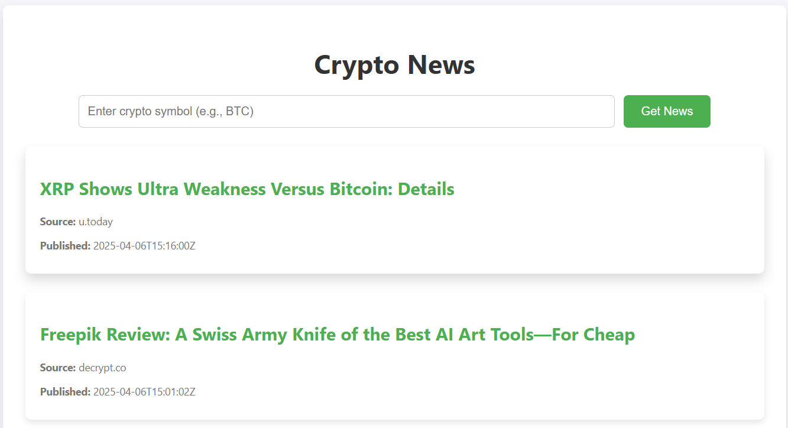

# 📰 Crypto News Aggregator

A simple Rust-based web service that displays the latest cryptocurrency news. Users can search by cryptocurrency symbol (e.g., BTC, ETH), and the service fetches data from CryptoPanic and other sources (in the future).

---

## 🚀 Features

- Search news by cryptocurrency name or symbol
- Live API integration with CryptoPanic
- User-friendly one-page interface
- Responsive news cards with source, title, time, and summary
- Server written in Rust using Axum
- HTML/CSS frontend (fully static)
- Supports user-triggered and auto-fetching of news

---

## 🧑‍💻 Usage

1. **Clone the repository**  
   ```bash
   git clone https://github.com/yourusername/crypto-news-rust.git
   cd crypto-news-rust
2. **Set up the environment**
Create a `.env` file and add your CryptoPanic API key:
    ```bash
    CRYPTOPANIC_API_KEY=your_api_key_here
    ```
3. **Build and run the server**
    ```
    cargo run
    ```
4. **Open in browser**

Navigate to: http://127.0.0.1:3000/news

## 📸 Demo




## 💡 Examples

**Example 1: Auto-fetch on page load**

On visiting /news, the app automatically fetches all latest cryptocurrency news.

**Example 2: User-triggered fetch**

Type `ETH` in the input field and hit "Get News" → live news is fetched and displayed.

## Developers

- [Danial Yerzhigit](https://github.com/riqqer)
- [Nuraiym Sadyk](https://github.com/wstyx-hh)
- [Diana Abish](https://github.com/hsibAD)